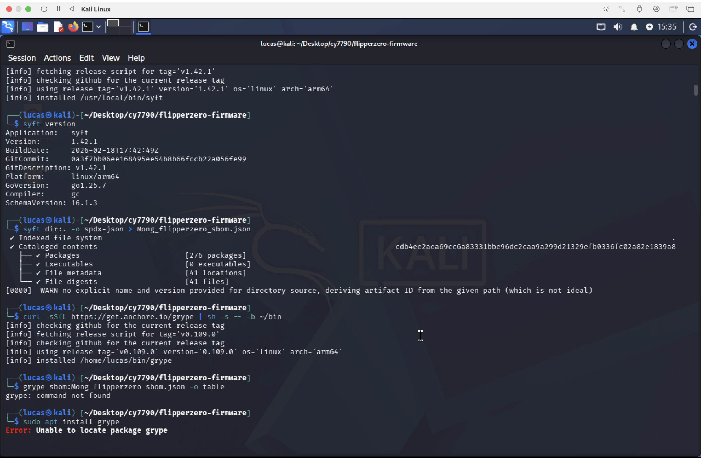
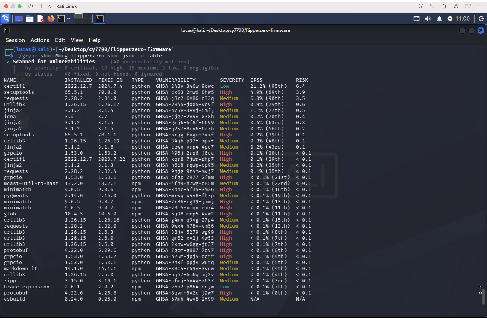

# Software Bill of Materials (SBOM) Analysis: Flipper Zero Firmware

## Overview

This project demonstrates an end-to-end **Software Bill of Materials (SBOM) generation and vulnerability analysis** on the Flipper Zero open-source firmware. Using industry-standard tools — Anchore Syft for SBOM generation and Anchore Grype for vulnerability scanning — I cataloged 176 software components and identified **40 known vulnerabilities** (19 High, 18 Medium, 3 Low) in an older firmware commit.

This was completed as part of my graduate coursework in CY 7790 Medical Device Cybersecurity at Northeastern University, applying principles from the IMDRF N73 guidance and NTIA minimum elements framework (Executive Order 14028).

---

## What Is a Software Bill of Materials?

An SBOM is a structured inventory of every software component inside a product — its name, version, supplier, and how it relates to other components. Think of it like a nutrition label for software. The NTIA defines it as "a formal record containing the details and supply chain relationships of various components used in building software."

### Why This Matters

Modern software — especially firmware in connected devices like the Flipper Zero — is not written from scratch. It's assembled from dozens or hundreds of third-party libraries, open-source packages, and vendor-supplied components. The problem is that any one of these ingredients can have a vulnerability that emerges at any time.

Consider a real-world scenario: a critical CVE is published for mbedTLS, a cryptographic library. Without an SBOM, an organization has no efficient way to answer the question "which of our products contain mbedTLS, and which version?" They'd have to manually dig through every codebase. With an SBOM, that lookup takes seconds.

This is exactly the problem that drove Executive Order 14028 (Improving the Nation's Cybersecurity) to mandate SBOM as a minimum requirement for software sold to the U.S. government, and why the IMDRF N73 guidance recommends SBOMs for all medical devices throughout their Total Product Lifecycle.

---

## The Target: Flipper Zero Firmware

The Flipper Zero is an open-source multi-tool for hardware exploration and cybersecurity research. Its firmware is built in C/C++ and depends on several critical third-party libraries managed through Git submodules:

| Library | Purpose | Risk Surface |
|---|---|---|
| **mbedTLS** | TLS/cryptographic operations, BLE pairing | Cryptographic vulnerabilities, side-channel attacks |
| **FreeRTOS-Kernel** | Real-time operating system | Privilege escalation, task handling bugs |
| **STM32 HAL** | Hardware abstraction for STM32WB chip | Driver-level vulnerabilities |
| **protobuf** | RPC communication protocol | Parsing vulnerabilities, denial of service |
| **libusb_stm32** | USB stack | USB protocol handling exploits |
| **microtar** | TAR archive handling | Archive parsing vulnerabilities |
| **heatshrink** | Data compression | Buffer handling issues |

I targeted an older commit (`35c1bfc`) specifically because older code is more likely to contain outdated dependencies with known CVEs — exactly the scenario SBOMs are designed to catch.

---

## Tools Used

| Tool | Purpose |
|---|---|
| **Anchore Syft** | Open-source CLI tool for generating SBOMs from directories and container images |
| **Anchore Grype** | Companion vulnerability scanner that cross-references SBOMs against NVD and GHSA |
| **Git** | Repository cloning and submodule management |
| **Kali Linux** | Operating environment for the analysis |
| **NIST NVD** | National Vulnerability Database for manual CVE lookups |

---

## Step-by-Step Process

### Step 1: Clone the Firmware Repository

```bash
git clone --recursive https://github.com/flipperdevices/flipperzero-firmware.git
cd flipperzero-firmware
git checkout 35c1bfc
git submodule update --init --recursive
```

The `--recursive` flag is critical. The Flipper Zero firmware manages its third-party dependencies through Git submodules — without this flag, the `lib/` directory containing mbedTLS, FreeRTOS, and other libraries would be empty, and our SBOM would miss the most important components.

The `git checkout 35c1bfc` switches to an older commit that is more likely to contain outdated, vulnerable versions of these libraries. After checking out, `git submodule update --init --recursive` ensures all submodules are pinned to the exact versions that were used at that point in the firmware's history.

### Step 2: Install and Run Anchore Syft

```bash
# Install Syft system-wide
curl -sSfL https://get.anchore.io/syft | sudo sh -s -- -b /usr/local/bin

# Generate the SBOM in SPDX JSON format
syft dir:. -o spdx-json > Mong_flipperzero_sbom.json
```

Breaking down the Syft command:
- `dir:.` — tells Syft to scan the current directory as a filesystem (not a container image). This is the correct approach for firmware source code repositories.
- `-o spdx-json` — outputs in SPDX JSON format, one of three industry-standard SBOM formats (alongside CycloneDX and SWID) recognized by the NTIA minimum elements.
- `> Mong_flipperzero_sbom.json` — redirects the structured output to a file.

Syft indexed the entire filesystem and **cataloged 176 packages**, identifying Python packages, npm modules, and other components present in the repository's build tooling and scripts.



### Step 3: Install and Run Anchore Grype

```bash
# Install Grype to the current directory
curl -sSfL https://get.anchore.io/grype | sh -s -- -b .

# Verify installation
./grype version

# Scan the SBOM for known vulnerabilities
./grype sbom:Mong_flipperzero_sbom.json -o table
```

Grype reads the SBOM file, extracts every component and its version, and cross-references them against multiple vulnerability databases including the **National Vulnerability Database (NVD)** and **GitHub Security Advisories (GHSA)**. It outputs a table showing the package name, installed version, fixed version, vulnerability ID, severity, and EPSS score.

**Result: 40 vulnerability matches** — 19 High severity, 18 Medium, 3 Low. All 40 had available fixes, meaning the older firmware commit was using significantly outdated versions of these components.



---

## Vulnerability Deep Dive: urllib3 — GHSA-v845-jxx5-vc9f

From the 40 vulnerabilities identified, I selected **GHSA-v845-jxx5-vc9f** for detailed analysis:

| Field | Detail |
|---|---|
| **Package** | urllib3 |
| **Installed Version** | 1.26.15 |
| **Fixed Version** | 1.26.17+ |
| **Severity** | High |
| **EPSS Score** | 0.9% (74th percentile) |
| **Type** | Python |

**What is urllib3?** It's one of the most downloaded Python packages globally — a powerful HTTP client library used extensively in Python tooling. In the Flipper Zero context, it's part of the firmware's build scripts and development tooling rather than running on the device itself.

**Why this matters for supply chain security:** Even though urllib3 doesn't execute on the Flipper Zero hardware, it represents a **build environment risk**. If an attacker compromises the build pipeline through a vulnerable urllib3 dependency, they could inject malicious code into the compiled firmware binary — an attack vector that has been seen in real-world supply chain incidents like SolarWinds and Codecov.

**Other notable findings from the scan:**
- **protobuf 4.22.0** (High) — directly relevant since Flipper Zero uses protobuf for its RPC communication protocol
- **grpcio 1.53.0** (High) — multiple vulnerabilities across the gRPC framework
- **jinja2 3.1.2** (Medium) — template injection risks in the build system
- **setuptools 65.5.1** (High) — Python package management vulnerabilities

---

## Challenges and Lessons Learned

### Disk Space Constraints
On my initial Ubuntu VM, the root partition was 100% full (9.5GB of 9.6GB). Syft completed its scan and cataloged 176 packages, but couldn't write the output file. I attempted to free space with `sudo apt-get clean` and `autoremove` but the VM remained too constrained. I resolved this by switching to Kali Linux with 72GB of available space.

### Grype Installation Difficulties
Installing Grype required multiple attempts across different methods. `sudo apt install grype` failed because Grype isn't in default apt repositories. `sudo snap install grype --classic` failed because snap wasn't available on Kali. The official curl installer returned a 502 HTTP error from GitHub (temporary server outage). After retrying, I installed Grype to the current directory using `curl -sSfL https://get.anchore.io/grype | sh -s -- -b .` and ran it with the `./grype` prefix since the current directory wasn't in PATH.

### SBOM Completeness for Embedded Firmware
This was the most significant technical insight from the project. Syft's catalogers are optimized for standard package manager ecosystems — pip, npm, Maven — where dependency information is stored in manifest files like `requirements.txt` or `package.json`. The Flipper Zero firmware is primarily C/C++ and manages its core dependencies through **Git submodules**, which standard SBOM catalogers don't recognize.

This means the 176 packages Syft identified are primarily from the Python and npm **build tooling** surrounding the firmware, not the embedded C libraries (mbedTLS, FreeRTOS, STM32 HAL) that actually run on the device hardware. This is a known limitation discussed in the IMDRF N73 guidance, which identifies firmware and embedded software as the hardest component types for SBOM generation.

**To generate a more complete SBOM, you could:**
- Manually inspect the `.gitmodules` file to catalog all submodule dependencies and their pinned versions
- Use Syft's `--select-catalogers` flag to enable additional cataloger types
- Run a **binary SCA tool** against the compiled firmware `.elf` file to capture exactly what the compiler included in the final binary
- Cross-reference submodule versions against the NVD manually (e.g., checking `lib/mbedtls/include/mbedtls/version.h`)

---

## Real-World Context: Why SBOMs Matter for Connected Devices

This project demonstrates concepts that apply directly to medical device cybersecurity and IoT security:

**Regulatory landscape:** The FDA now expects SBOMs as part of premarket cybersecurity submissions. Executive Order 14028 mandates SBOMs for software sold to the U.S. government. The IMDRF N73 guidance provides international recommendations for SBOM implementation across the medical device lifecycle.

**Vulnerability cascade risk:** A single vulnerable library like protobuf can be embedded in thousands of devices from different manufacturers. Without SBOMs, healthcare providers and device manufacturers have no efficient way to determine exposure when a new CVE is published.

**Build environment as attack surface:** The urllib3 finding illustrates that supply chain risk extends beyond what runs on the device. Compromising a build tool — as seen in the SolarWinds attack — can inject malicious code into the final product without touching the source code.

**Defense-in-depth:** SBOMs are not a security solution on their own. They are a transparency layer that enables vulnerability management, risk assessment, procurement decisions, and incident response. As the NTIA framework states, SBOMs form "a foundational data layer on which further security tools, practices, and assurances can be built."

---

## Key Takeaways

Working through this project reinforced several important concepts. First, **SBOM generation is only as good as the tools' understanding of your dependency model** — automated tools excel at standard package ecosystems but struggle with embedded firmware that uses submodules, custom build systems, or vendor-supplied binaries. Second, **vulnerability management is a lifecycle commitment, not a one-time scan** — all 40 vulnerabilities had available fixes, showing how quickly software falls behind when dependencies aren't actively maintained. Third, **supply chain risk extends to the build environment** — even components that don't run on the target device can introduce risk if they're compromised during the build process.

This project gave me hands-on experience with the exact tools and frameworks (Syft, Grype, SPDX, NVD, GHSA) that organizations use in production to manage software supply chain risk — directly applicable to GRC, SOC, and cybersecurity engineering roles.

---

## References

- IMDRF/CYBER WG/N73FINAL:2023 — Principles and Practices for Software Bill of Materials for Medical Device Cybersecurity
- NTIA — The Minimum Elements for a Software Bill of Materials (EO 14028), July 2021
- NIST National Vulnerability Database — [nvd.nist.gov](https://nvd.nist.gov)
- GitHub Security Advisories — [github.com/advisories](https://github.com/advisories)
- Anchore Syft Documentation — [github.com/anchore/syft](https://github.com/anchore/syft)
- Anchore Grype Documentation — [github.com/anchore/grype](https://github.com/anchore/grype)
- CISA SBOM Solutions Showcase — [cisa.gov](https://www.cisa.gov)
- Flipper Zero Firmware — [github.com/flipperdevices/flipperzero-firmware](https://github.com/flipperdevices/flipperzero-firmware)
